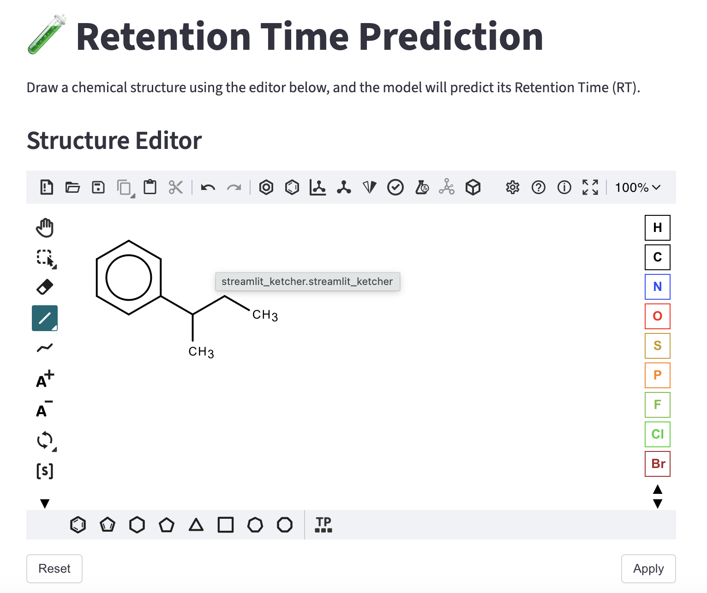

# A Practical, End-to-End Tutorial on Machine Learning-based Predictive Modeling
This repository provides comprehensive guidance and essential scripts for building predictive models of molecular properties using Jupyter notebooks.

## Setting the Environment
This repository includes two separate configuration files to accommodate both GPU and CPU execution. While GPU acceleration significantly improves performance for certain packages, all code remains fully functional without specialized hardware.

For optimal package management and simplified environment configuration, we recommend first installing either [Anaconda](https://www.anaconda.com/download) or [Miniconda](https://www.anaconda.com/docs/getting-started/miniconda/install). Both provide robust dependency management tools that streamline environment setup.

1. CPU only environment
```sh
# execute the following in the command line tool
conda env create -f environment-cpu.yaml
```
2. GPU enbaled environment

```
conda env create -f environment-gpu.yaml
```
## Model deployment
1. Standalone script
Model prediction can be made by running the deployment script after activating the Python environment in command line interfacre.
For example, the prediction can be made for one structure each time.
```sh
python standalone.py --smiles "C1CCCCC1" "CCO" "c1ccccc1"
```
Similarly, predictions can be made a for series of molecular structures.
```sh
python standalone.py --smiles "C1CCCCC1" "CCO" "c1ccccc1"
```
2. GUI interface
The model can also be deployed locally with a graphical user interface (GUI) or as a web application. A brief example using Streamlit is provided, which includes a molecular drawing tool. Users can simply draw a structure and click a button to get the prediction.
To run the GUI deployment, the environment created in the very begininng needs to be activated first.
```shell
conda activate learning-project
```
Running the deployment script.
```shell
streamlit run streamlit_gui.py 
```
A new browser tab will open with the interface. If it does not open automatically, you can manually visit the following address: [http://localhost:8501](http://localhost:8501).



3. API deployment
